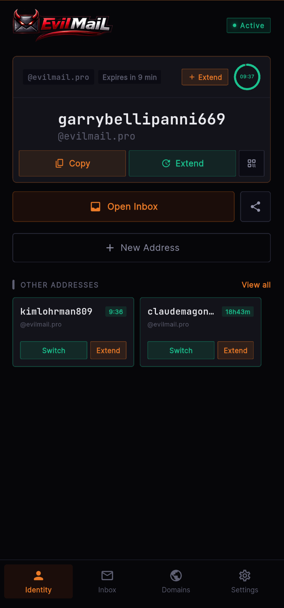
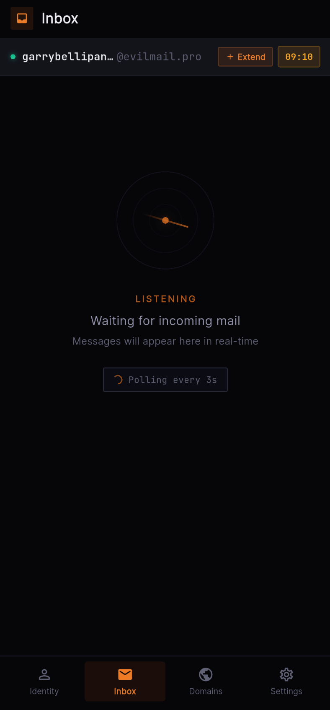
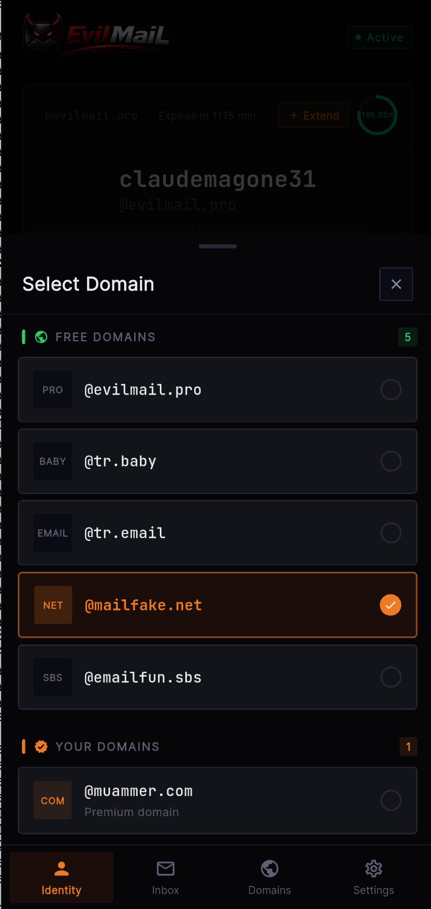
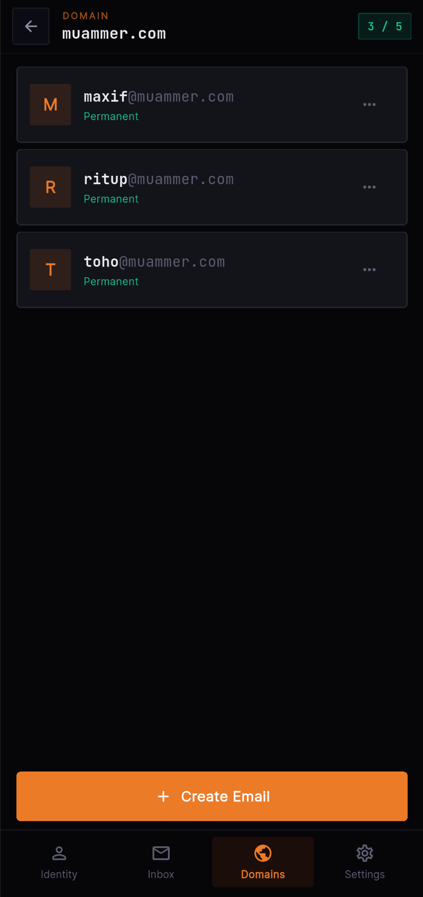
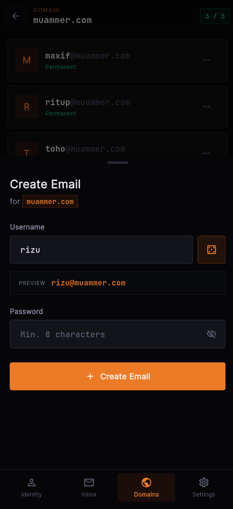
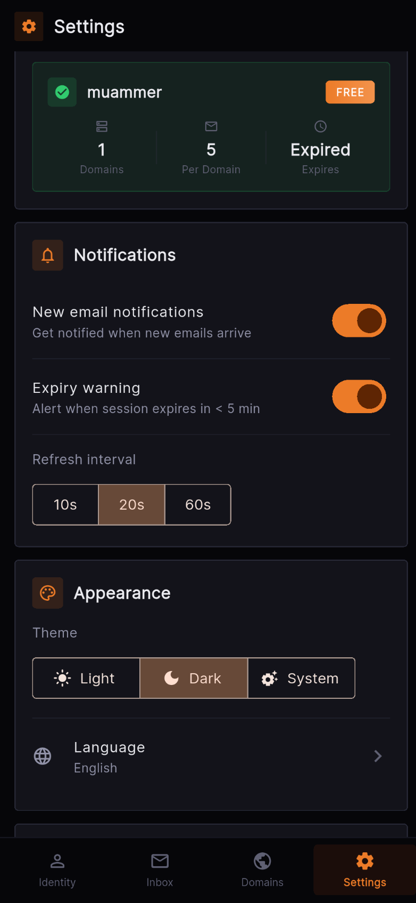

<div align="center">


# EvilMail Mobile

**Disposable email, redefined.** Privacy-first temporary email app for Android.

[](https://github.com/Evil-Mail/evilmail-mobile/releases/latest)
[](https://evilmail.pro/apps)
[](#license)
[](https://evilmail.pro)

<br/>

[](https://github.com/Evil-Mail/evilmail-mobile/releases/latest)

<br/>

</div>

---

<div align="center">

### Create temporary emails in seconds. No signup. No tracking. No compromise.

</div>

<br/>

<div align="center">
<table>
<tr>
<td align="center"><br/><sub><b>Identity Dashboard</b></sub></td>
<td align="center"><br/><sub><b>Real-time Inbox</b></sub></td>
<td align="center"><br/><sub><b>Domain Selection</b></sub></td>
</tr>
<tr>
<td align="center"><br/><sub><b>Custom Domain Emails</b></sub></td>
<td align="center"><br/><sub><b>Create Email</b></sub></td>
<td align="center"><br/><sub><b>Settings</b></sub></td>
</tr>
</table>
</div>

<br/>

## Features

<table>
<tr>
<td width="50%">

### Instant Temporary Email
Create a disposable email address with one tap. Choose your preferred domain and expiration time. Your address auto-destructs when the timer runs out.

### Real-time Inbox
Emails arrive instantly with live polling. No need to manually refresh — messages appear as soon as they're received.

### Smart Verification Code Detection
Automatically detects OTP and verification codes in incoming emails. Copy them with a single tap — perfect for signing up for services without exposing your real email.

</td>
<td width="50%">

### Custom Domains
Connect your API key to use your own custom domains. Create permanent email accounts on your domains and manage them directly from the app.

### Session Management
- Extend active sessions before they expire
- Restore expired addresses within 48 hours
- Switch between multiple addresses instantly
- View full address history

### Share Easily
Share your temporary address via QR code, shortlink, or direct copy to clipboard.

</td>
</tr>
</table>

## Privacy by Design

```
No account required to get started
No personal data collected
No ads, no tracking
Temporary addresses are permanently deleted after expiration
```

## Perfect For

| Use Case | Description |
|----------|-------------|
| Website Signups | Register without receiving spam |
| Verification Codes | Receive OTP codes privately |
| Email Testing | Test email functionality during development |
| Inbox Protection | Shield your real inbox from unwanted mail |
| One-time Access | Temporary registrations and free trials |

## Languages

Available in **9 languages**: English, Turkish, Russian, Ukrainian, Polish, Persian, Filipino, French, and German.

## Themes

Beautiful interface with **automatic theme detection** based on your system settings. Supports both dark and light modes.

## Download

> **Note:** EvilMail is currently available as a direct APK download while we await Google Play Store approval.

### Latest Release

| | |
|---|---|
| **Version** | v1.0.0 |
| **Min Android** | 6.0 (API 23) |
| **Architecture** | Universal (arm64-v8a, armeabi-v7a, x86_64) |

[**Download APK**](https://github.com/Evil-Mail/evilmail-mobile/releases/latest) — check the SHA1 hash to verify integrity.

## Also Available On

<div align="center">

[](https://addons.mozilla.org/addon/evilmail-disposable-temp-email/)
[](https://chromewebstore.google.com/detail/evilmail-disposable-temp/fgendnmboedmnihlmcpcdpmhlhklnjmc)
[](https://evilmail.pro)
[](https://t.me/evilmailbot)

</div>

## API

EvilMail provides a RESTful API for developers. Integrate disposable email into your own applications and workflows.

[**View API Documentation**](https://evilmail.pro/api-docs)

## License

This is a proprietary application. The source code is not open source. APK binaries are distributed freely for personal use.

Browser extensions are open source and available on GitHub:
- [EvilMail Chrome Extension](https://github.com/Evil-Mail/evilmail-chrome)
- [EvilMail Firefox Extension](https://github.com/Evil-Mail/evilmail-firefox)

---

<div align="center">

**[evilmail.pro](https://evilmail.pro)**

Your inbox, your rules.

<sub>Made with privacy in mind.</sub>

</div>
